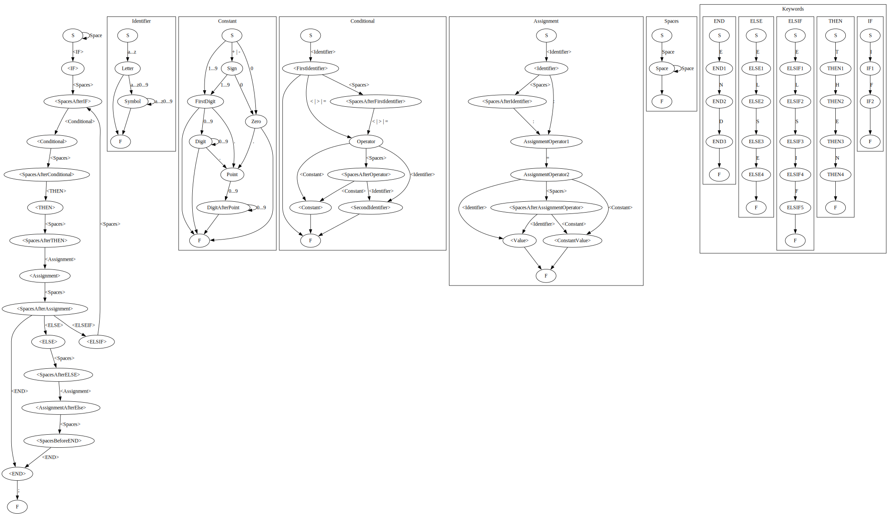

# Формальный анализатор условного оператора языка Modula-2
### Лабораторная работа по дисциплине "Теория автоматов и формальных языков"

---
### Граф состояний анализатора
Граф состояний создан с помощью визуализатора графов [Graphviz](https://graphviz.org) и формального языка [Dot](https://graphviz.org/doc/info/lang.html)

